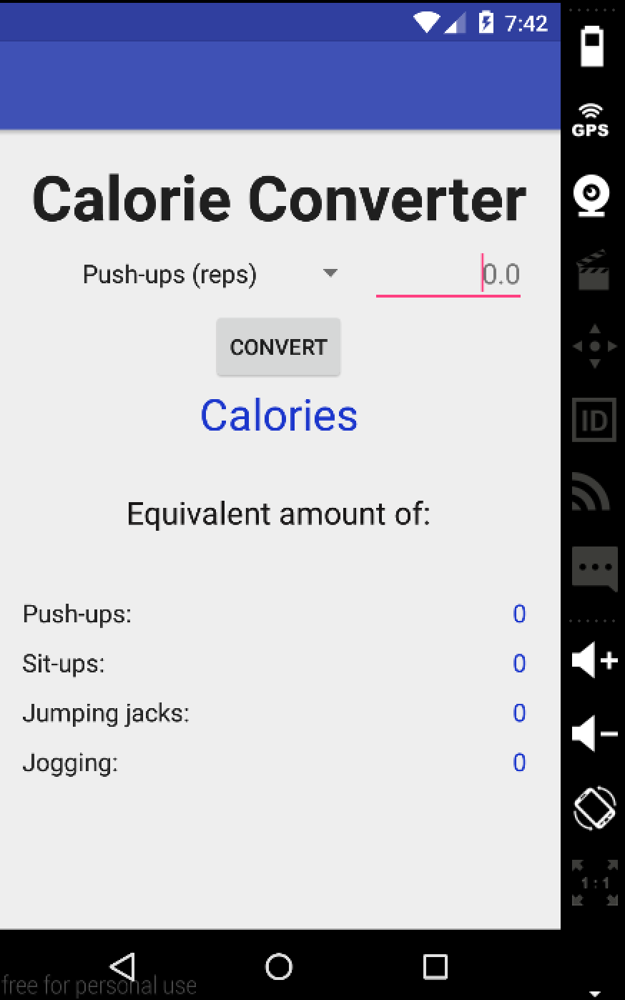
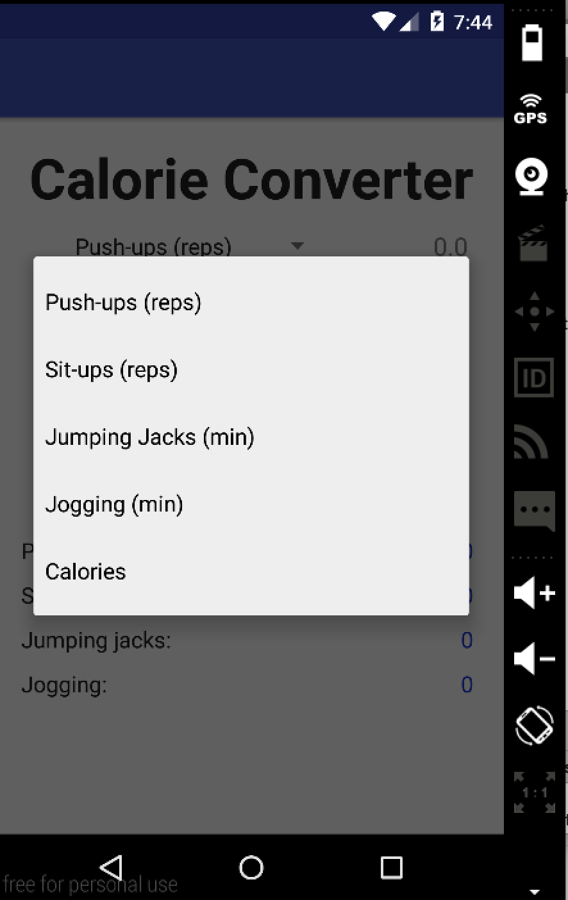
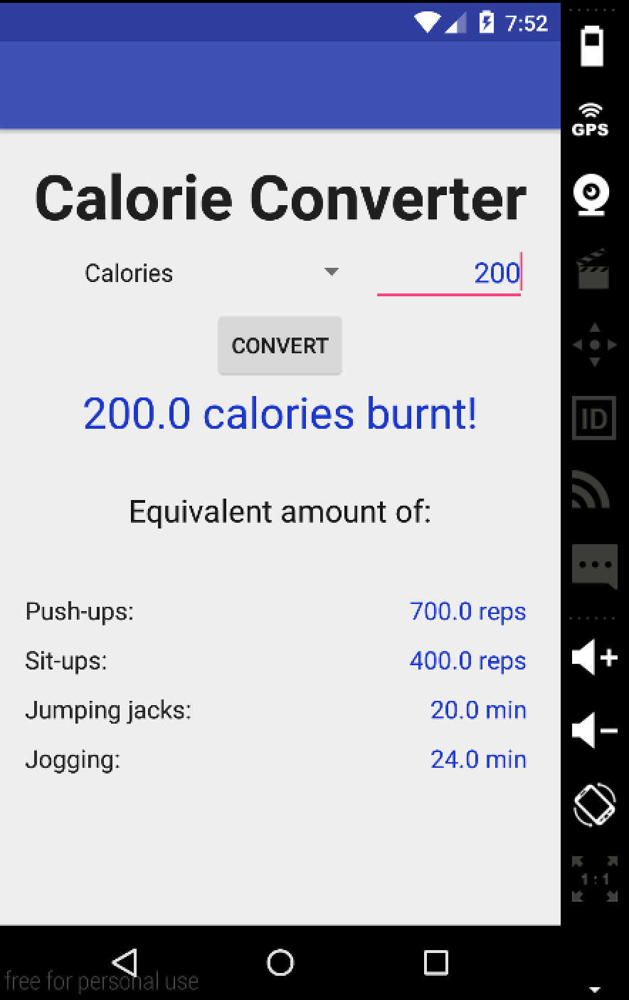

# PROG 01: Crunch Time

The application allows the user to select an activity, input an amount, and then click convert to display the amount of calories burnt. The app also displays the amount of exercise needed to burn the same amount of calories for other activities. The app can also convert calories to units of exercise, which can be done by selecting "Calories" in the menu and inputtng an amount. 

## Authors

Nithish Arunkumar ([nithisharunk@berkeley.edu](mailto:nithisharunk@berkeley.edu))

## Demo Video

See [CS160 SP16 PROG01] (https://youtu.be/Ohv6iuzi6I0)

## Screenshots

## Acknowledgments

Thank you to Vivz(slidenerd) and Derek Banas from YouTube for showing me how it's done. 

